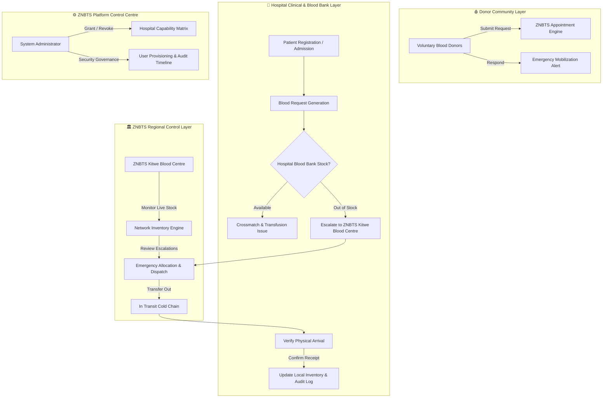
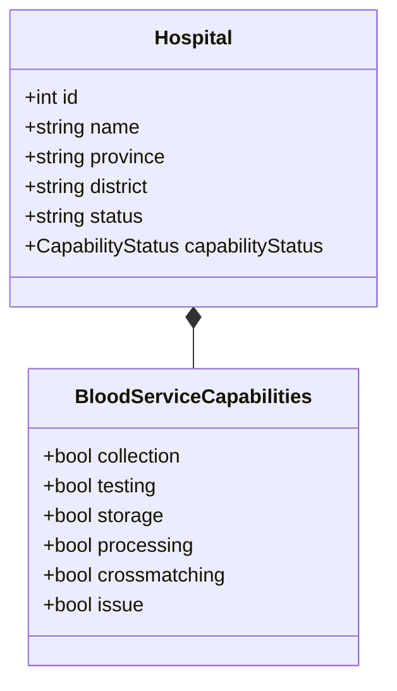
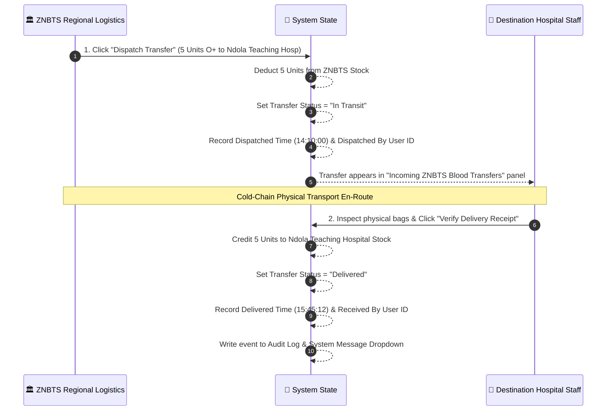

# 🩸 UMULOPA Safe Transfer — ZNBTS Copperbelt Network
## Master Operational Manual, System Architecture & Complete Functional Presentation Guide
*Official Reference Manual for ZNBTS Executive Inspection, Hospital Directors & Engineering Team Handover*

---

> [!IMPORTANT]
> **System Purpose & Vision**  
> **UMULOPA Safe Transfer** is a state-of-the-art, digital blood cold-chain logistics, patient transfusion, hospital inventory management, and emergency mobilization ecosystem engineered specifically for the **Zambia National Blood Transfusion Service (ZNBTS)** across the **Copperbelt Province**. It connects ZNBTS Regional Headquarters (*ZNBTS Kitwe Blood Centre*), Level 1, 2 & 3 Hospitals (*Ndola Teaching Hospital, Kitwe Teaching Hospital, District & Mission Hospitals*), clinical staff, and voluntary blood donors into a synchronized real-time data network.

---

# 📚 Table of Contents
1. [System Architecture & Operational Boundaries](#1-system-architecture--operational-boundaries)
2. [Role-Based Access Control (RBAC) & Governance](#2-role-based-access-control-rbac--governance)
3. [Hospital Authorization & Capability Control Framework](#3-hospital-authorization--capability-control-framework)
4. [End-to-End Core Operational Workflows](#4-end-to-end-core-operational-workflows)
   - [Workflow A: Donor Registration, Appointment Booking & 8-Week Interval Tracking](#workflow-a-donor-registration-appointment-booking--8-week-interval-tracking)
   - [Workflow B: Hospital Patient Registration & Clinical Request Creation](#workflow-b-hospital-patient-registration--clinical-request-creation)
   - [Workflow C: Regional Escalation, Emergency Allocation & Stock Reservation](#workflow-c-regional-escalation-emergency-allocation--stock-reservation)
   - [Workflow D: 2-Step Chain-of-Custody Dispatch & Verified Delivery Tracking](#workflow-d-2-step-chain-of-custody-dispatch--verified-delivery-tracking)
   - [Workflow E: Hospital Blood Bank Management & Earliest-Expiring Lot Usage (FEFO)](#workflow-e-hospital-blood-bank-management--earliest-expiring-lot-usage-fefo)
   - [Workflow F: Inter-Hospital Contingency Peer Transfer Flow](#workflow-f-inter-hospital-contingency-peer-transfer-flow)
5. [Real-Time Notifications & Audit Timeline Architecture](#5-real-time-notifications--audit-timeline-architecture)
6. [Official ZNBTS Medical PDF & Excel Reporting System](#6-official-znbts-medical-pdf--excel-reporting-system)
7. [Enterprise Scaling & High-Volume Performance Engineering](#7-enterprise-scaling--high-volume-performance-engineering)
8. [Monday Presentation Defense & Executive QA Guide](#8-monday-presentation-defense--executive-qa-guide)

---

# 1. System Architecture & Operational Boundaries



---

# 2. Role-Based Access Control (RBAC) & Governance

The platform strictly enforces four primary roles and sub-role permissions to protect patient privacy and restrict privileged actions:

```
                  ┌─────────────────────────────────────────┐
                  │    ZNBTS System Administrator (admin)   │
                  └────────────────────┬────────────────────┘
                                       │
         ┌─────────────────────────────┼─────────────────────────────┐
         ▼                             ▼                             ▼
┌─────────────────┐           ┌─────────────────┐           ┌─────────────────┐
│ Regional Centre │           │ Hospital Staff  │           │   Blood Donor   │
│   (regional)    │           │     (staff)     │           │     (donor)     │
└─────────────────┘           └────────┬────────┘           └─────────────────┘
                                       │
             ┌─────────────────────────┼─────────────────────────┐
             ▼                         ▼                         ▼
   ┌──────────────────┐      ┌──────────────────┐      ┌──────────────────┐
   │ Blood Bank Off.  │      │ Medical Officer  │      │ Nurse / Records  │
   └──────────────────┘      └──────────────────┘      └──────────────────┘
```

### Role Capabilities & Scope Boundaries

| Role Name | User Scope | Navigable Modules | Key Operational Actions |
| :--- | :--- | :--- | :--- |
| **System Administrator** | Province-Wide | `/admin`, `/admin/users`, `/admin/hospitals`, `/admin/permissions`, `/admin/audit-logs`, `/admin/reports`, `/admin/system-health`, `/admin/backup` | User creation/suspension, approving hospital registrations, granting blood-service capabilities, system backup execution, auditing. |
| **Regional Blood Centre** | Copperbelt Region | `/regional`, `/regional/inventory`, `/regional/distribution`, `/regional/hospitals`, `/regional/emergency`, `/regional/transfers`, `/regional/analytics`, `/regional/reports` | Allocation of ZNBTS central stock, emergency request approval, dispatching inter-hospital blood transfers, regional analytics. |
| **Hospital Staff** | Scoped to own `hospitalId` | `/staff`, `/patients`, `/patients/add`, `/patients/request`, `/patients/transfusions`, `/inventory`, `/staff/blood-bank`, `/staff/emergency`, `/staff/team`, `/staff/profile` | Patient record creation, submitting blood requests, recording transfusions, clearing collection lots, verifying ZNBTS delivery receipt. |
| **Blood Donor** | Scoped to own Donor ID | `/donor`, `/donor/donate`, `/donor/appointments`, `/donor/donations`, `/donor/history`, `/donor/eligibility`, `/donor/emergency`, `/donor/profile` | Booking donation visits, viewing verified donation records, checking 8-week interval eligibility, responding to emergency calls. |

---

# 3. Hospital Authorization & Capability Control Framework

> [!CAUTION]
> **Legal & Regulatory Compliance Rule:**  
> Registering a hospital on the platform **NEVER automatically grants blood processing authority**. ZNBTS administrators must explicitly grant or revoke individual operational capabilities based on clinical inspections.



### Detailed Breakdown of Blood-Service Capabilities

When a hospital registers, selecting services represents a **request only**. ZNBTS regulations strictly govern which capabilities are granted to ensure patient safety and blood cold-chain integrity across Zambia:

#### 1. 🩸 Blood Collection (`collection`)
- **System Behavior:** Unlocks the local donor blood collection recording module.
- **Clinical Meaning:** The hospital possesses trained phlebotomy personnel, sterile collection bags, donor screening protocols, and equipment to collect blood from voluntary donors.
- **Unapproved Rule:** The hospital cannot record local blood collections. Donor collections must take place at ZNBTS blood centers or authorized mobile drives.

#### 2. 🔬 Blood Testing / Screening (`testing`)
- **System Behavior:** Allows hospital staff to clear collected blood lots for clinical availability.
- **Clinical Meaning:** The hospital operates accredited laboratory screening for transfusion-transmissible infections (**HIV, Hepatitis B, Hepatitis C, and Syphilis**) and ABO/Rh grouping.
- **Unapproved Rule:** Any blood collected locally is automatically flagged **`Pending ZNBTS Testing`** and must be physically transported to the **ZNBTS Kitwe Blood Centre** for testing before clinical release.

#### 3. ❄️ Blood Storage (`storage`)
- **System Behavior:** Permits holding available blood stock balances in local hospital inventory.
- **Clinical Meaning:** The hospital maintains specialized, temperature-monitored blood bank refrigerators ($2^\circ\text{C} \text{ to } 6^\circ\text{C}$) with back-up generator power to prevent blood spoilage.
- **Unapproved Rule:** The hospital cannot hold stock reserves; delivered blood must be administered immediately for acute patient emergencies.

#### 4. 🧪 Component Processing (`processing`)
- **System Behavior:** Enables component separation workflows.
- **Clinical Meaning:** The hospital operates refrigerated centrifuges to process whole blood into specific components:
  - **Packed Red Blood Cells (PRBC)** — for severe anemia or surgical blood loss.
  - **Fresh Frozen Plasma (FFP)** — for clotting factor deficiencies.
  - **Platelets** — for cancer therapy or severe bleeding disorders.
- **Unapproved Rule:** The facility is restricted to Whole Blood units only.

#### 5. 🧬 Crossmatching (`crossmatching`)
- **System Behavior:** Unlocks serological compatibility verification before blood bag release.
- **Clinical Meaning:** Lab technologists test recipient serum against donor red blood cells to prevent fatal hemolytic transfusion reactions.
- **Unapproved Rule:** Samples must be sent to ZNBTS or a Level 3 Teaching Hospital for compatibility clearance.

#### 6. 💉 Blood Issue / Release (`issue`)
- **System Behavior:** Authorizes hospital staff to issue blood bags and record clinical transfusions in patient records.
- **Clinical Meaning:** The facility is certified to administer blood transfusions in wards, operating theaters, and emergency units with clinical monitoring.
- **Unapproved Rule:** The hospital is not authorized to administer transfusions locally.

---

# 4. End-to-End Core Operational Workflows

---

### Workflow A: Donor Registration, Appointment Booking & 8-Week Interval Tracking

1. **Profile Registration:** Voluntary donor registers profile with full name, contact details, and registered blood group (e.g. `O+`).
2. **Appointment Scheduling:** Donor selects preferred date and donation center (*ZNBTS Kitwe Blood Centre* or *Ndola Donation Centre*).
3. **8-Week Eligibility Calculation:**  
   The system automatically calculates donation readiness using clinical interval rules:
   $$\text{Next Eligible Date} = \text{Date of Last Verified Donation} + 56 \text{ Days (8 Weeks)}$$
   - If $< 56$ days: Status shows **"Ineligible — Must wait $X$ days"** (Amber badge).
   - If $\ge 56$ days or first time: Status shows **"Eligible to Donate"** (Green badge).
4. **Emergency Mobilization Alerts:** When a hospital issues a `Critical` or `Emergency` request for `O+`, all matching $O+$ donors receive an urgent mobilization call on their portal.

---

### Workflow B: Hospital Patient Registration & Clinical Request Creation

1. **Patient Registration:** Hospital staff registers patient details (Name, NRC/Identifier, Age, Gender, Ward/Department, Blood Group).
2. **Request Generation:** Clinician submits request specifying required units, blood group, urgency level (`Routine`, `High`, `Critical`, `Emergency`), and target patient ID.
3. **Local Inventory Check:** System checks hospital's local blood bank balance.
   - If stock is sufficient: Request moves to local crossmatching and issue.
   - If stock is insufficient: Staff clicks **Escalate to ZNBTS Kitwe Blood Centre**.

---

### Workflow C: Regional Escalation, Emergency Allocation & Stock Reservation

1. **Escalation Queue Alert:** Escalated requests immediately appear on the ZNBTS Regional Dashboard and header notifications.
2. **Stock Verification:** ZNBTS logistics officer reviews live province-wide inventory across all 8 blood groups (`A+`, `A-`, `B+`, `B-`, `AB+`, `AB-`, `O+`, `O-`).
3. **Approval & Allocation:** ZNBTS officer approves request. The system reserves required units at ZNBTS Kitwe Blood Centre.

---

### Workflow D: 2-Step Chain-of-Custody Dispatch & Verified Delivery Tracking

To ensure 100% accountability and prevent lost blood bags during transport:



---

### Workflow E: Hospital Blood Bank Management & Earliest-Expiring Lot Usage (FEFO)

1. **First-Expired, First-Out (FEFO) Rule:** When recording blood usage for patient transfusion, the system automatically selects blood lots with the earliest expiration date:
   $$\text{Lot Priority} = \operatorname{sort\_by\_ascending}(\text{ExpiryDate})$$
2. **Lot Status States:**
   - `Testing`: Collected blood undergoing screening.
   - `Available`: Cleared for clinical use.
   - `Reserved`: Allocated to an approved request.
   - `Issued`: Administered to patient.
   - `Expired`: Exceeded safety shelf life.
3. **Automatic Expiry Reconciliation:** A daily background process automatically moves lots past their expiration date to `Expired` and updates network stock.

---

### Workflow F: Inter-Hospital Contingency Peer Transfer Flow

1. **Nearby Request:** If a hospital experiences a sudden shortage (e.g. multi-trauma emergency) before ZNBTS dispatch arrives, staff can issue a **Nearby Hospital Request** to adjacent facilities (e.g. *Mufulira District Hospital requesting Kitwe Teaching Hospital*).
2. **Peer Transfer Execution:** The source hospital accepts the request. Stock is transferred directly between hospital balances without passing through central ZNBTS inventory.

---

# 5. Real-Time Notifications & Audit Timeline Architecture

The system features dynamic, live notifications in the top navigation bar:

```
┌─────────────────────────────────────────────────────────────────────────┐
│ 🔔 Notifications (2)                                                   │
├─────────────────────────────────────────────────────────────────────────┤
│ • 3 critical blood request(s) active in system state.                  │
│ • Alert: 2 blood unit lot(s) have reached expiration.                  │
└─────────────────────────────────────────────────────────────────────────┘
┌─────────────────────────────────────────────────────────────────────────┐
│ ✉️ Live System Events (Audit Timeline)                                  │
├─────────────────────────────────────────────────────────────────────────┤
│ • Transfer TRF-8492: Dispatched 5 Units O+ to Ndola Teaching Hosp       │
│ • Hospital Approval: Kafue Riverside Hospital capability granted       │
│ • Emergency Request: Amina Mwansa escalated to ZNBTS Kitwe Blood Centre │
└─────────────────────────────────────────────────────────────────────────┘
```

---

# 6. Official ZNBTS Medical PDF & Excel Reporting System

The platform includes a built-in reporting engine ([`exportUtils.js`](file:///c:/Users/ARNOLD%20MALAMA/Downloads/UMULOPA-Safe-Transfer-ZNBTS-Copperbelt-Recovered/src/utils/exportUtils.js)) that generates official medical documents for Ministry of Health audits:

```
┌─────────────────────────────────────────────────────────────────────────┐
│                     ZAMBIA NATIONAL BLOOD TRANSFUSION SERVICE           │
│             UMULOPA SAFE TRANSFER — COPPERBELT PROVINCE NETWORK          │
├─────────────────────────────────────────────────────────────────────────┤
│ Report Title:   Weekly Blood Distribution & Transfusion Audit           │
│ Facility Scope: ZNBTS Kitwe Blood Centre / Copperbelt Province          │
│ Generated Date: 27/08/2026, 17:15:21                                   │
├─────────────────────────────────────────────────────────────────────────┤
│ Date       │ Hospital                 │ Group │ Units │ Status          │
├────────────┼──────────────────────────┼───────┼───────┼─────────────────┤
│ 2026-08-27 │ Ndola Teaching Hospital  │ O+    │ 5     │ Delivered       │
│ 2026-08-27 │ Kitwe Teaching Hospital  │ A-    │ 2     │ In Transit      │
├─────────────────────────────────────────────────────────────────────────┤
│ Page 1 of 1 — Confidential Medical Record                               │
└─────────────────────────────────────────────────────────────────────────┘
```

---

# 7. Enterprise Scaling & High-Volume Performance Engineering

To handle millions of patient records and high-frequency hospital requests without performance degradation:

1. **Pre-Declared Static Lazy Imports (`App.jsx`):** All page components are pre-declared at module scope, preventing React from unmounting and re-suspending routes on re-renders.
2. **Context-Local Suspense Fallbacks (`Layout.jsx`):** Suspense boundaries wrap only the content pane (`<Outlet />`). The sidebar and header remain rendered and responsive at all times.
3. **Persistent BroadcastChannel State Sync (`AppStateProvider.jsx`):** State listeners persist across component lifecycles, avoiding memory leaks during rapid state broadcasts.
4. **Indexed Data Structure Ready for Backend REST/GraphQL APIs:** Data records are normalized with strict keys (`facilityId`, `hospitalId`, `patientId`, `timestamp`), making the frontend 100% plug-and-play with PostgreSQL / MySQL backend databases.

---

# 8. Monday Presentation Defense & Executive QA Guide

### 🎯 Key Presentation Talking Points for System Owners

1. **Introductory Pitch:**  
   *"Welcome Leaders and Stakeholders. Today we present UMULOPA Safe Transfer—a complete digital blood cold-chain management system built for ZNBTS Copperbelt Network. It connects our Kitwe Blood Centre, 9 Copperbelt hospitals, clinicians, and voluntary donors in real-time."*

2. **Demonstrating Chain-of-Custody:**  
   *"Notice how when ZNBTS dispatches blood to Ndola Teaching Hospital, the system stamps the exact departure time and flags it as 'In Transit'. Stock is only credited to Ndola Teaching Hospital when their officer clicks 'Verify Delivery Receipt', stamping the arrival time and officer ID."*

3. **Demonstrating Security & Isolation:**  
   *"When a hospital staff member logs in, they only see patient records and inventory for their facility. Only ZNBTS System Administrators can grant operational capabilities like collection or testing."*

### ❓ Top Executive Questions & Instant Bulletproof Answers

- **Q1: "Can a hospital start collecting blood on their own without ZNBTS approval?"**  
  👉 **Answer:** *"No. The system enforces ZNBTS Capability Control. If ZNBTS has not granted collection or testing authority in the Admin Panel, the hospital's collection form is locked."*

- **Q2: "What happens if a critical emergency occurs and ZNBTS is far?"**  
  👉 **Answer:** *"The platform features a Nearby Hospital Peer Request workflow. Ndola Teaching Hospital can request emergency blood directly from Kitwe Teaching Hospital as a temporary contingency while ZNBTS coordinates main supply."*

- **Q3: "How do we prevent using expired blood bags?"**  
  👉 **Answer:** *"The system enforces FEFO (First-Expired, First-Out). When issuing blood, the software automatically picks the earliest-expiring cleared lot. Expired lots are automatically quarantined."*

- **Q4: "Can we print official reports for Ministry of Health audits?"**  
  👉 **Answer:** *"Yes! Clicking PDF or Excel generates branded ZNBTS documents with official headers, hospital facility names, timestamps, and page numbers."*

---

*Master Operational Manual & Presentation Guide prepared for ZNBTS System Demonstration.*
